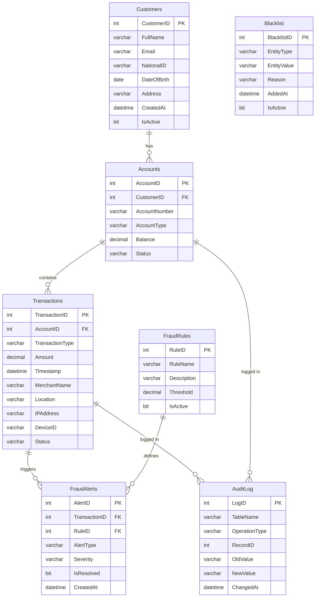

# 🛡️ Fraud Detection System

A fully implemented database project for **Introduction to Database Systems** (BFT-4C).  
Built with **Microsoft SQL Server** and a **Streamlit** web dashboard.

---

## 👥 Group Members

| Name | Roll No |
|------|---------|
| Amin Zaidi | — |
| Abubakar Faisal | — |
| Abdullah Shah | — |

**Section:** BFT-4C  
**Instructors:** Nida Aslam | Inzmam Haq

---

## 📌 Project Overview

The Fraud Detection System monitors financial transactions in real time and automatically flags suspicious activity based on configurable rules. It covers all required database concepts including DDL, DML, joins, subqueries, stored procedures, functions, views, triggers, and constraints.

---

## 🗄️ Database Schema

| Table | Description |
|-------|-------------|
| `Customers` | Account holders and their personal info |
| `Accounts` | Bank accounts linked to customers |
| `Transactions` | All financial transaction records |
| `FraudAlerts` | Alerts generated by fraud detection rules |
| `FraudRules` | Configurable thresholds and detection logic |
| `Blacklist` | Banned IPs, devices, and merchants |
| `AuditLog` | System-level change tracking via triggers |

---

## 📊 Entity Relationship Diagram



> 💡 **Tip:** If the diagram doesn't render above (e.g. on a local markdown viewer), open `fraud_detection_erd.html` in your browser for a fully styled interactive version.

---

## ✅ SQL Concepts Covered

- **DDL** — Table creation with constraints (PK, FK, CHECK, UNIQUE, DEFAULT)
- **DML** — INSERT, UPDATE, DELETE with sample data
- **Joins** — INNER, LEFT, SELF joins across all entities
- **Subqueries** — Nested SELECT for fraud detection logic
- **Stored Procedures** — 5 procedures for search, flag, resolve, blacklist
- **Functions** — Scalar risk score function + inline table-valued function
- **Views** — 4 views for alerts, summaries, blacklisted transactions, daily stats
- **Triggers** — Auto-flag large transactions, block blacklisted entities, audit log, block suspended accounts

---

## 🖥️ Frontend Dashboard (Streamlit)

6-page interactive dashboard:
- **Dashboard** — KPI metrics, charts, risk score table
- **Transactions** — Filterable transaction explorer
- **Fraud Alerts** — Active alerts with resolve functionality
- **Customers** — Per-customer transaction summaries
- **Blacklist** — View and add blacklist entries
- **Admin Tools** — Manual flagging and audit log

---

## 🚀 Setup Instructions

### Prerequisites
- Python 3.8+
- Microsoft SQL Server 2019/2022/2025
- ODBC Driver 17 for SQL Server

### 1. Run the SQL Script
Open `fraud_detection.sql` in SSMS and execute (F5).

### 2. Install Python dependencies
```bash
pip install streamlit pyodbc pandas plotly
```

### 3. Configure the database connection
Open `fraud_dashboard.py` and update:
```python
SERVER   = "your-server-name"
DATABASE = "FraudDetection"
USERNAME = "frauduser"
PASSWORD = "Fraud@1234"
```

### 4. Run the dashboard
```bash
streamlit run fraud_dashboard.py
```

Open [http://localhost:8501](http://localhost:8501)

---

## 📁 Files

| File | Description |
|------|-------------|
| `fraud_detection.sql` | Complete SQL script (tables, data, procedures, triggers, views) |
| `fraud_dashboard.py` | Streamlit web dashboard |
| `fraud_detection_erd.html` | Standalone interactive ERD diagram |
| `requirements.txt` | Python dependencies |

---

## 🛠️ Tech Stack

- **Database:** Microsoft SQL Server 2025
- **Query Tool:** SQL Server Management Studio (SSMS)
- **Frontend:** Python + Streamlit + Plotly
- **Connector:** pyodbc (ODBC Driver 17)
